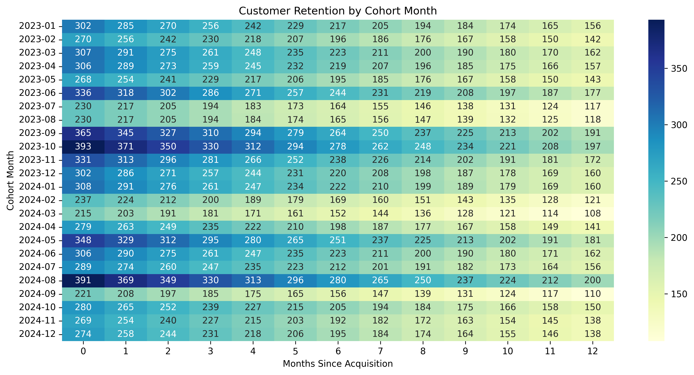
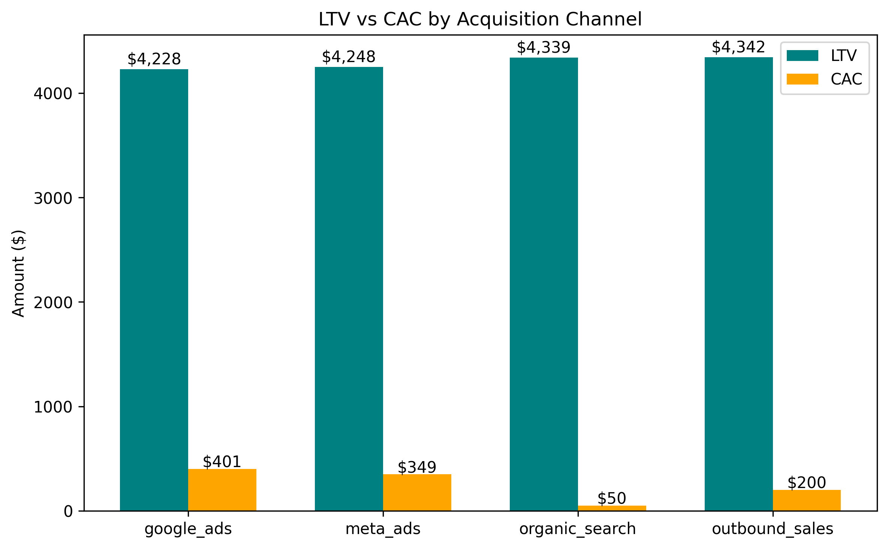
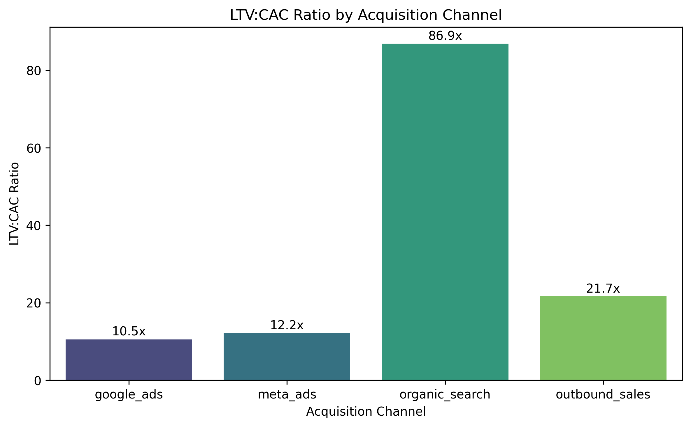
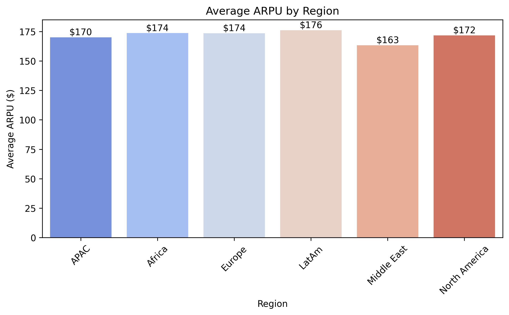

# CAC & LTV Model

This project models Customer Acquisition Cost (CAC), Lifetime Value (LTV), and retention dynamics for a fictional SaaS business operating in six global regions. Using synthetic data, the analysis explores:

- CAC calculations by acquisition channel
- LTV calculations based on ARPU, gross margin, and churn
- LTV:CAC ratios
- Cohort analysis and retention trends
- Visualizations including cohort heatmaps, bar charts for LTV/CAC, and ARPU by region
- SQL analysis replicating all Python insights

---

## Who Is This For?

- Financial analysts monitoring CAC and LTV
- SaaS business stakeholders exploring marketing ROI
- Data professionals building business-focused analytics
- Python learners applying data viz to business KPIs

---

## Project Structure

| Plot | Filename | Description |
|------|----------|-------------|
| **1** | `plot1_cohort_heatmap.png` | Customer retention heatmap by cohort month |
| **2** | `plot2_ltv_vs_cac.png` | LTV vs CAC by acquisition channel (side-by-side bar chart) |
| **3** | `plot3_ltv_cac_ratio.png` | LTV:CAC ratio by acquisition channel |
| **4** | `plot4_arpu_by_region.png` | Average ARPU by global region |
| **Text** | `executive_summary.txt` | Executive summary with key insights and recommendations |
| **SQL** | Various `.sql` files | SQL queries for replicating CAC, LTV, and cohort analyses |

---

## Sample Visuals

| Plot 1 | Plot 2 |
|--------|--------|
|  |  |

| Plot 3 | Plot 4 |
|--------|--------|
|  |  |

---

## Output Files

- `plot1_cohort_heatmap.png`
- `plot2_ltv_vs_cac.png`
- `plot3_ltv_cac_ratio.png`
- `plot4_arpu_by_region.png`
- `executive_summary.txt`
- SQL queries:
  - `avg_cac_by_channel.sql`
  - `avg_ltv_by_channel.sql`
  - `ltv_cac_ratio.sql`
  - `cohort_analysis.sql`

---

## Tools & Libraries

- Python 3
- pandas
- numpy
- matplotlib
- seaborn
- Google BigQuery (SQL)

---

> **Note:** This is a synthetic dataset. CAC values are likely lower than real-world SaaS benchmarks because marketing spend was randomized in a narrow range. In practice, CAC can vary significantly and may be 3–10x higher depending on industry, region, and product type.

---

## SQL Analysis

This project includes saved SQL queries in BigQuery for replicating key analyses:

- Average CAC by acquisition channel
- Average LTV by acquisition channel
- LTV:CAC ratio
- Customer cohort analysis by acquisition month

**BigQuery Table:**
```
cac-ltv-model.cac_ltv_data.cac_ltv_table
```

These queries can be executed directly in BigQuery. Results can also be exported and visualized using tools like Tableau, based on the exported CSV data.

---

## How to Run

### 1. Clone this Repo
```bash
git clone https://github.com/ameer-nassar/cac-ltv-model.git
cd cac-ltv-model
```

### 2. Install Requirements
```bash
pip install -r minimum_requirements.txt
```

### 3. Run the Script
```bash
python cac_ltv_model.py
```

## Recommendations 
```bash
- Shift budget away from higher-CAC channels toward organic and lower-cost acquisition strategies.
- Explore longer contract lengths to stabilize churn rates.
- Further segment marketing efforts by region, given ARPU differences.
```
